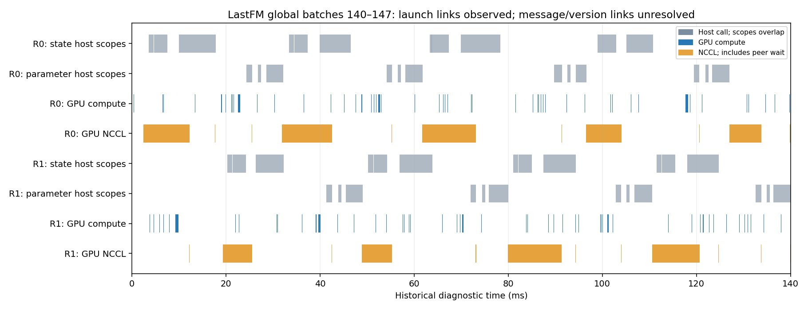
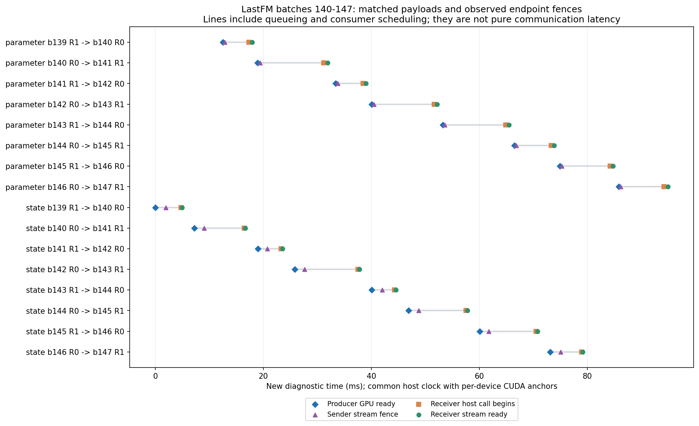

# LastFM E0 E1 E2 补充实验归档

2026-10-06 完成原始证据核验、六次参数传输新配对和一次端点版本诊断。参数 arena 保持 native 训练轨迹逐位一致，完整用时几何平均减少 2.78%，低于 3% 筛选门槛。结论、合同和边界见[实验记录](../../40-Experiments/2026-10-06-lastfm-critical-path.md)。

| 证据 | 入口 |
| --- | --- |
| 原始证据存在性与数据哈希 | [E0 inventory](analysis/source_inventory_remote.json) |
| 硬件和软件 | [runtime](analysis/runtime.json) |
| 正式比较合同与源文件哈希 | [E1 contract](plans/critical_20261006_s1_contract.json) |
| Adam 状态及 RNG 资格 | [qualification](analysis/paired_qualification.json) |
| 六次新配对结果 | [performance](analysis/performance_paired_results.json) |
| 历史 native 延续验证 | [lineage](analysis/historical_native_lineage.json) |
| 历史 kernel 与 API 关联 | [launch correlation](analysis/e2_existing/existing_launch_correlation.json) |
| 短诊断合同与正确性资格 | [E2 contract](analysis/e2_diagnostic_contract.json)、[qualification](analysis/e2_semantic_qualification.json) |
| 消息、版本与字段读取结果 | [endpoint analysis](analysis/e2_endpoints/endpoint_analysis.json) |
| batch 140 到 147 的实例 | [message and parameter case](analysis/e2_endpoints/case_140_147.json) |
| batch 140 的 CPU 字段版本 | [storage provenance](analysis/e2_endpoints/cpu_provenance_case_b140.json) |
| 文件导出与原始文件哈希 | [provenance](REMOTE_EXPORT_PROVENANCE.json) |





两图来自不同运行，时钟不拼接。CUDA event 标记 stream 就绪边界，不能充当实际 kernel 起止；原生 send 没有等待 Work 完成，因此发送完成与纯传输时长保持未知。CUDA anchor 的 host bracket 半宽分别为 26.497 μs、22.068 μs；这是本次映射的校准括号，不是 GPU 时钟长期漂移误差的完整估计。

## 离线核验

从统一项目根目录运行，只依赖 Python 标准库：

```bash
python3 artifacts/tgn_lastfm_critical_20261006/verify_archive.py
```

核验文件哈希、冻结源代码、完整事件计数、配对统计、消息哈希及已保存字段计数。重新检查 checkpoint 内容和全量逐读 provenance 需要服务器原始文件。

## 原环境复现

工作目录需要独立 `runs/analysis/plans/cache`，并接入原实验的 `vendor/pydeps/data/raw`。实测环境的 E1 与 E2 分别位于 `src/` 和 `e2/`，E2 不修改正式 E1 合同。

在原服务器工作目录，可采用新 campaign ID 先做资格、再做性能：

```bash
python src/run_interleaved_parameter_ablation.py --stage qualification --campaign-id NEW_ID --session-id s1 --indices 4,5 --python PYTHON_ABSOLUTE_PATH
python src/run_interleaved_parameter_ablation.py --stage performance --campaign-id NEW_ID --session-id s1 --indices 4,5 --python PYTHON_ABSOLUTE_PATH
```

`NEW_ID` 与 `PYTHON_ABSOLUTE_PATH` 需替换为新标签和匹配环境解释器。运行器锁定 GPU、保存前后资源观察、拒绝覆盖残缺运行；资格通过后冻结源码。原已完成 campaign 再调用只会读已有配对，不能算新重复。

E2 的实际 guard argv 保存于诊断合同；重跑需改为新 label 与 output。它包含一次校准同步、选择窗口的参数接收复制、payload 保留和 CPU 审计，只用于诊断，不能并入正式收益。

## 归档边界

九次新进程分别为两次资格、六次正式计时和一次 E2 诊断。保存 18 份轻量 rank summary、实测入口源码、哈希、消息关联及图表。GPU UUID、进程标识、锁路径和重型 per-batch 工作记录已从导出文件中去除；数据、模型、内存／optimizer／RNG checkpoint、完整 trace 和运行环境留在服务器。

一次资格编排在 GPU 子进程启动前因空目录未建立而失败，修正目录创建后完成；该次不计为训练测量。旧实验归档未修改。
