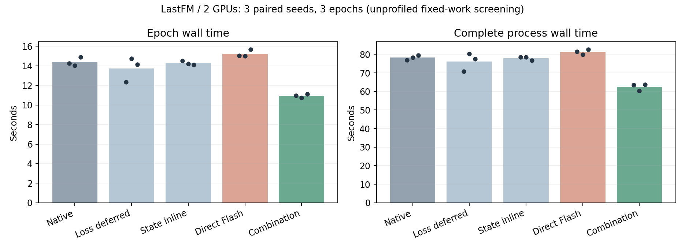
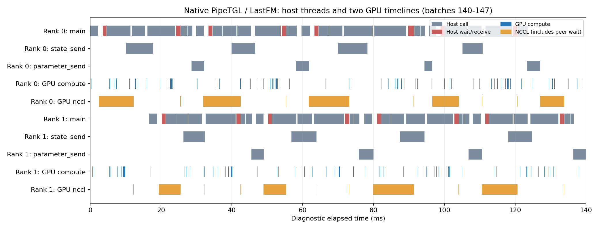
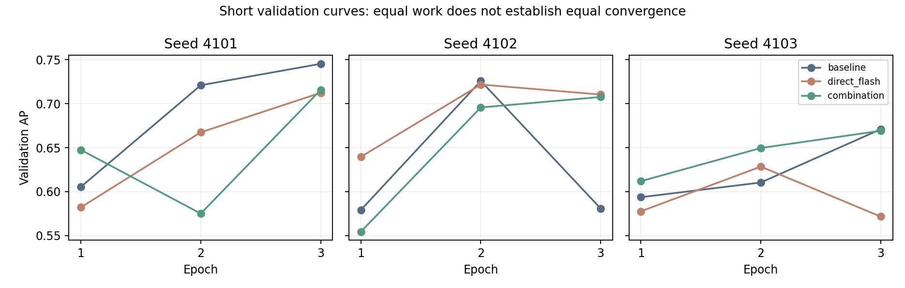

# LastFM：双卡线程与 warp 第一轮实验

2026-10-05 完成 5 个方案 × 3 个种子 × 3 epoch，共 15 次关闭 profiler 的短训练。每 epoch 固定处理 905,172 条训练事件；GPU 为两张同 NUMA 的 RTX PRO 6000 Blackwell Server Edition。

**组合方案的完整运行平均用时减少 20.1%，但验证 AP 和训练轨迹不同，目前只支持固定工作量吞吐收益，尚不支持同精度达标加速。** 单独 direct Flash 在三个种子均更慢；两个小型线程改动的筛选区间跨 1。

| 方案 | 平均 epoch / s | 完整进程 / s | 配对完整进程加速比 | 三 seed bootstrap 筛选区间 |
| --- | ---: | ---: | ---: | --- |
| 共同正确性修复后的原生 PipeTGL | 14.404 | 78.255 | 1.000× | — |
| 延后 loss 读取 | 13.746 | 76.186 | 1.029× | [0.976, 1.089] |
| state-inline | 14.278 | 77.972 | 1.004× | [0.980, 1.035] |
| 仅 direct Flash | 15.233 | 81.313 | 0.962× | [0.945, 0.980] |
| Flash + parameter arena + state-first/inline | 10.940 | 62.533 | 1.252× | [1.213, 1.297] |

完整进程包括启动、数据和图准备、原生 warm-up 更新、三轮训练与验证、退出。epoch 按两 rank 共同 `CLOCK_MONOTONIC` 的最早开始至最晚结束计算。三 seed 区间用于筛选，不能替代更多重复和完整训练。两种小型线程消融的训练参数、状态与 AP 曲线均与配对原生逐位相同。

## 阅读入口

| 内容 | 文件 |
| --- | --- |
| 完整结果、范围与下一步 | [results_round1.txt](results_round1.txt) |
| 运行条件与离线核验 | [REPRODUCE.md](REPRODUCE.md) |
| 逐 seed 指标及配对统计 | [paired_short_training.json](analysis/paired_short_training.json) |
| 15 次运行的两 rank 汇总 | [runs/](runs/) |
| 冻结状态资格 | [frozen_qualification.json](analysis/frozen_qualification.json) |
| 30 个 rank 的初始权重、训练参数和状态检查 | [trained_model_checks.json](analysis/trained_model_checks.json) |
| CPU 线程、GIL、调度与 GPU 活动 | [thread_gpu_breakdown.json](analysis/thread_gpu_breakdown.json) |
| 双卡时间线 | [thread_gpu_timeline.png](analysis/thread_gpu_timeline.png) |
| sampler warp 指标 | [ncu_sampler_b16_selected.json](analysis/ncu_sampler_b16_selected.json) |
| sampler C++ / DGL 拆分 | [sampler_component_breakdown.json](analysis/sampler_component_breakdown.json) |
| 实际 payload、NUMA 和 NCCL 微实验 | [communication_breakdown.json](analysis/communication_breakdown.json) |
| 状态依赖代理与 chunk 复用上界 | [dependency_breakdown.json](analysis/dependency_breakdown.json) |
| 原始文件与归档文件哈希、导出方式 | [ARCHIVE_MANIFEST.json](ARCHIVE_MANIFEST.json) |
| 本次归档核验结果 | [ARCHIVE_VERIFICATION.json](ARCHIVE_VERIFICATION.json) |

## CPU 线程与 GPU warp

未开 Nsight 的线程诊断中，采样包装占主线程约 9%，每 batch loss 标量读取约 0.18%。真实中段输入的 50 次重放中，一次 sampler 调用中位数约 1.11 ms：C++ sampler 约 0.42 ms，DGL 包装约 0.67 ms。C++ 部分含 CUDA 编排和结果拷贝。

Nsight 同时采集两个 rank：约 78% 的计算 kernel 不超过 5 μs。sampler 的 NCU 样本为 71 blocks / 188 SM，eligible warps 很少，long scoreboard 为主要 stall 来源。recent sampler 预留 48 KiB dynamic shared memory，而函数源码没有使用该区；尚未修改或验证这一假设。

Nsight 显式 profiler overhead 的联合区间每 rank 约 6 s / 24.67 s，所以 trace 的绝对比例仅作诊断。GPU 事件空白不等于 SM idle，NCCL kernel 时间含对端等待；主线程 wall spans 不等于 on-core 运算时间，重叠区间不能相加。调度线程状态为 Unknown，无法精确区分 blocked 与 runnable。

## 正确性与精度

五个冻结权重方案的最终 memory、mailbox 和两种时间戳逐位相同，future-read 时间戳审计为零。所有正式训练的初始权重与配对基线相同，最终张量有限。该资格范围没有证明 Flash 的 forward/gradient 等价或最终精度保持。

| 方案 | seed 4101 最终 AP | seed 4102 | seed 4103 |
| --- | ---: | ---: | ---: |
| 原生 / loss-deferred / state-inline | 0.745365 | 0.580843 | 0.670907 |
| direct Flash | 0.712372 | 0.710395 | 0.571641 |
| 组合方案 | 0.715627 | 0.707636 | 0.669183 |

## 通信与后续消融

同 NUMA 的实际参数 payload 为 891,604 B。逐张量的 24 条消息与合并成一条消息，独立通信完成时间的中位数为 0.7358 / 0.0835 ms，约 8.8 倍差异。这是两端 host completion 的最大值，含 API、对端到达和 CUDA 完成，不能直接换算训练收益。跨 NUMA 的合并消息约 0.1082 ms；这里只有一个 GPU 对，不能泛化为所有 NUMA 场景。

为了拆开组合方案，补充了保留 native attention、原生状态发送线程、baseline 顺序的 parameter-arena 消融。冻结检查通过，seed 4101 的训练参数、状态和 AP 曲线也与原生逐位相同；但运行结束时检测到选定 GPU 被其他任务占用，**该次性能已排除**。其余有效性能种子尚未补齐，见[资源状态](analysis/parameter_ablation_status.json)和[排除记录](analysis/excluded_parameter_trial.json)。三个有效种子的恢复脚本在 [run_parameter_ablation.py](src/run_parameter_ablation.py)，重试使用新目录并保留旧记录。

## 数据与历史核验

使用 [JODIE LastFM](https://snap.stanford.edu/jodie/) 的真实 1,293,103 条事件，980 用户、1,000 items、1,980 nodes。按 70% / 85% 时间分位点切分，训练 / 验证 / 测试为 905,172 / 193,965 / 193,966；同时间戳不跨边界拆开。保留真实 2 维零 edge features，无 node features，没有构造额外特征。

新数据的 src、dst、time、ext_roll 与历史 LastFM 全部逐行一致。历史 NPZ 仅索引训练前缀，不能当成完整验证/测试图。见[数据清单](analysis/data_manifest.json)和[历史数据比较](analysis/historical_data_comparison.json)。历史 CPU 结构普查和带不同人造特征的外部训练日志未混入本次性能基线。

## 依赖、研究方向与未执行工作

全部 1,508 对相邻 batch 都存在节点状态 RAW/WAW 重叠。这个 batch DAG 是状态前沿的代理，不能推出整个 forward/backward 必须串行；参数接收实际发生在 backward 后、optimizer.step 前。

按 support node 的状态写入版本计数，chunk=4/8 的状态记录准备复用乐观上界约 42.0% / 51.5%；它不包括 learned activations 的复用承诺。原生 prepare_input 已在 memory updater 前按 node unique，88.5% 的重复采样槽位不能直接当成剩余 GRU 冗余。

DOLPHIN、REAL、TempGNN 摘要启发了 chunk 准备、版本感知状态包和有序提交的假设，相关[文献与研究笔记](https://github.com/wangwenqingqq/distribution-tgn)。这些是本项目推断，尚非论文复现或新机制的实测收益。当前 LastFM 很小，磁盘—RAM 特征搬运不是优先假设。

未执行 unused shared-memory 改动、chunk/packet 实现、正式 1/2/4/8 卡 scaling、完整精度及 time-to-target 实验。本目录保留实测源码和轻量统计；第三方依赖、数据、权重、原始逐事件记录、完整 Nsight/NCU trace 由原实验目录保留。
